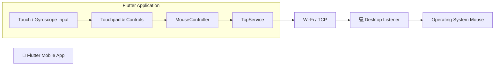

# 🖱️ Mobile Mouse

Turn your Android phone into a **wireless touchpad and remote mouse** for your laptop.

**Mobile Mouse** is a Flutter-based application that sends touchpad gestures, gyroscope motion, and mouse click events from your phone to a lightweight desktop listener over a local Wi-Fi network. The desktop listener translates these events into native mouse actions, allowing your phone to work as a wireless mouse and experimental motion controller.


---

## ✨ Features

### 🖐️ Dual Input Modes

* **Touchpad Mode**

  * Use the phone screen as a wireless touchpad.
  * Drag your finger to move the laptop cursor.
  * Designed for smooth and responsive pointer movement.

* **Gyroscope Mode**

  * Use the phone's gyroscope to control pointer movement.
  * Streams real-time motion data to the desktop listener.
  * Requires a physical device with a gyroscope sensor.

### 🖱️ Mouse Controls

* Dedicated **Left Click** button.
* Dedicated **Right Click** button.
* Click events are transmitted to the desktop listener over TCP.
* Desktop listener generates native OS-level mouse events.

### 🔌 Quick Connection

* Enter the laptop's IP address.
* Configure the TCP port.
* Default port: `5000`.
* Connection status is displayed directly in the application.
* Persistent TCP connection for real-time input streaming.

### 🎨 Modern Interface

* Gradient splash screen.
* Branded application interface.
* Responsive layout.
* Clear connection status.
* Touchpad control surface.
* Dedicated mouse controls.

### 🌐 Cross-Platform Foundation

Built using:

* Flutter
* Dart
* `sensors_plus`
* TCP sockets
* JSON-based communication

The current primary use case is **Android → Desktop**, while the Flutter project provides a foundation for additional platforms.

---

# 🧱 Architecture

The application follows a simple event-streaming architecture:



### Data Flow

```text
Phone Input
    │
    ├── Touchpad gestures
    │
    └── Gyroscope motion
          │
          ▼
    MouseController
          │
          ▼
      JSON Payload
          │
          ▼
       TcpService
          │
          ▼
      TCP / Wi-Fi
          │
          ▼
   Desktop Listener
          │
          ▼
   Native Mouse Events
          │
          ▼
      Laptop Cursor
```

### Main Components

#### `MouseController`

Responsible for:

* Processing touchpad movement.
* Processing gyroscope input.
* Handling left-click events.
* Handling right-click events.
* Converting input into the application's JSON protocol.

#### `TcpService`

Responsible for:

* Establishing the TCP connection.
* Maintaining the socket connection.
* Sending newline-delimited JSON payloads.
* Handling connection failures.
* Logging outbound messages for debugging.

#### `GyroscopeEvents`

The application uses `sensors_plus` to access gyroscope data.

Gyroscope events are converted into pointer-related values before being sent to the desktop listener.

---

# 📡 Communication Protocol

Mobile Mouse communicates with the desktop listener using:

```text
TCP
```

The default port is:

```text
5000
```

The protocol uses **newline-delimited JSON (NDJSON)**.

### Example Payload

```json
{"gyroX":-0.12,"gyroY":0.08,"leftClick":false,"rightClick":false}
```

Each JSON object is sent as a separate line.

### Payload Fields

| Field        | Type      | Description                      |
| ------------ | --------- | -------------------------------- |
| `gyroX`      | `number`  | Horizontal movement/motion value |
| `gyroY`      | `number`  | Vertical movement/motion value   |
| `leftClick`  | `boolean` | Indicates a left-click event     |
| `rightClick` | `boolean` | Indicates a right-click event    |

### Input Semantics

The meaning of `gyroX` and `gyroY` depends on the active control mode:

* **Touchpad Mode:** values represent calculated pointer movement deltas.
* **Gyroscope Mode:** values represent processed gyroscope movement data used by the desktop listener to calculate pointer movement.

The desktop listener is responsible for converting these values into actual cursor movement.

---

# 🖥️ Desktop Listener

The mobile application requires a desktop listener running on the laptop.

The listener:

1. Opens a TCP server.
2. Waits for connections from the mobile application.
3. Receives newline-delimited JSON.
4. Parses the input events.
5. Converts movement values into cursor movement.
6. Converts click events into native mouse clicks.

### Desktop Listener Repository

The full desktop listener source code is available here:

https://github.com/gnyanarushi/mobile-mouse-desktop-app

---

# 🚀 Getting Started

## Prerequisites

Before running Mobile Mouse, make sure you have:

* Flutter `3.9+`
* Dart `3.9+`
* Android Studio or VS Code
* A physical Android device or Android emulator
* A laptop/desktop running the Mobile Mouse desktop listener
* Both devices connected to the same Wi-Fi network

> **Note:** Gyroscope control requires a physical device with a gyroscope sensor. Most Android emulators cannot provide realistic gyroscope input.

---

# 💻 Install the Desktop Listener

## macOS

Using Homebrew:

```bash
brew tap gnyanarushi/mobile-mouse-desktop-app
brew install mobile-mouse-desktop-app
```

Start the listener:

```bash
mobile-mouse-desktop
```

The default port is:

```text
5000
```

To specify a custom host and port:

```bash
mobile-mouse-desktop --host 0.0.0.0 --port 5000
```

---

## Windows

Install the desktop listener using PowerShell:

```powershell
curl -fsSL https://raw.githubusercontent.com/gnyanarushi/homebrew-mobile-mouse-desktop-app/main/install.ps1 | Invoke-Expression
```

Alternatively, download the installer from the desktop listener releases:

https://github.com/gnyanarushi/mobile-mouse-desktop-app/releases

---

## Linux / Manual Installation

Run the released JAR:

```bash
java -jar mobile-mouse-desktop-app.jar
```

Or build it from source:

```bash
git clone https://github.com/gnyanarushi/mobile-mouse-desktop-app.git

cd mobile-mouse-desktop-app

./gradlew build

java -jar build/libs/mobile-mouse-desktop-app.jar
```

---

# 📱 Install the Flutter Application

Clone the repository:

```bash
git clone https://github.com/gnyanarushidev/mobile-mouse-mobile-app.git
```

Enter the project directory:

```bash
cd mobile-mouse-mobile-app
```

Install dependencies:

```bash
flutter pub get
```

Check the Flutter environment:

```bash
flutter doctor
```

Run the application:

```bash
flutter run
```

---

# 🔗 Connecting the Phone to the Laptop

Both devices must be connected to the **same local network**.

For example:

```text
Laptop IP: 192.168.1.10
Port:      5000
```

Start the desktop listener first:

```bash
mobile-mouse-desktop --host 0.0.0.0 --port 5000
```

Then open the Mobile Mouse application and enter:

```text
IP Address: 192.168.1.10
Port:       5000
```

Tap:

```text
Connect
```

The application should display the connection status.

> **Important:** The laptop IP address depends on your local network. Do not assume that `10.5.5.10` will be the correct address for every setup.

---

# 📱 App Walkthrough

## 1. Splash Screen

When the application starts, the branded splash screen is displayed.

It contains:

* Application logo
* Gradient background
* Application branding
* Short tagline

---

## 2. Connection Screen

The connection card allows the user to configure the desktop listener.

Example:

```text
Laptop IP
192.168.1.10

Port
5000

[ Connect ]
```

The application displays connection feedback such as:

```text
Connected
```

or:

```text
Connection failed
```

---

## 3. Touchpad Mode

The touchpad surface acts as a wireless trackpad.

Basic interaction:

```text
Finger movement
      │
      ▼
Touchpad
      │
      ▼
Pointer Delta
      │
      ▼
JSON
      │
      ▼
TCP
      │
      ▼
Desktop Cursor
```

---

## 4. Gyroscope Mode

Enable:

```text
Use Gyroscope Control
```

The application starts reading gyroscope data using `sensors_plus`.

The processed movement values are streamed to the desktop listener.

> Gyroscope control is intended for experimental motion-based cursor control and may require calibration depending on the device.

---

## 5. Mouse Clicks

The application provides dedicated buttons for:

```text
[ Left Click ]     [ Right Click ]
```

Click events are sent to the desktop listener.

---

# 🖥️ Desktop Listener Configuration

The desktop listener normally listens on:

```text
0.0.0.0:5000
```

This means it accepts connections on the available network interfaces.

### Example

```text
Phone
192.168.1.20
     │
     │ Wi-Fi
     ▼
Laptop
192.168.1.10:5000
     │
     ▼
Mobile Mouse Desktop Listener
     │
     ▼
Native OS Mouse
```

---

# 🔐 Network & Firewall

If the phone cannot connect to the laptop, verify:

### 1. Same Wi-Fi

Both devices should be connected to the same local network.

### 2. Laptop IP

Find the laptop's local IP address.

For example:

```text
192.168.1.10
```

### 3. Port

Make sure the desktop listener is running on:

```text
5000
```

or use the custom port configured in the application.

### 4. Firewall

Make sure the operating system firewall allows incoming TCP connections on the configured port.

### 5. Router Isolation

Some public or guest Wi-Fi networks prevent devices from communicating with each other.

If possible, use a trusted private Wi-Fi network.

---

# 🧪 Testing & Debugging

## Flutter Logs

The application logs outbound JSON payloads.

Example:

```text
Sending payload:
{"gyroX":-0.12,"gyroY":0.08,"leftClick":false,"rightClick":false}
```

These logs can be used to verify that the mobile application is generating and sending events.

---

## Connection Timeout

If you see:

```text
SocketException: Connection timed out
```

check:

* Laptop IP address.
* TCP port.
* Desktop listener status.
* Firewall configuration.
* Wi-Fi connection.
* Router/client isolation settings.

---

## Connection Refused

If you see:

```text
Connection refused
```

the desktop listener may not be running or may not be listening on the expected port.

Start it with:

```bash
mobile-mouse-desktop --host 0.0.0.0 --port 5000
```

---

# 📂 Project Structure

```text
mobile-mouse-mobile-app/
│
├── assets/
│   └── icon/
│       └── icon.png
│
├── lib/
│   ├── main.dart
│   │
│   ├── controllers/
│   │   └── mouse_controller.dart
│   │
│   └── services/
│       ├── tcp_service.dart
│       └── gyro_service.dart
│
├── android/
├── ios/
├── linux/
├── macos/
├── web/
├── windows/
│
├── pubspec.yaml
└── README.md
```

### Important Files

| File                    | Responsibility                                      |
| ----------------------- | --------------------------------------------------- |
| `main.dart`             | Application UI, splash screen and control interface |
| `mouse_controller.dart` | Mouse input processing and JSON payload creation    |
| `tcp_service.dart`      | TCP connection and message transmission             |
| `gyro_service.dart`     | Gyroscope event handling                            |
| `icon.png`              | Application branding                                |

---

# 🛠️ Technology Stack

| Technology     | Purpose                          |
| -------------- | -------------------------------- |
| Flutter        | Mobile application framework     |
| Dart           | Application programming language |
| `sensors_plus` | Gyroscope/sensor access          |
| TCP            | Network communication            |
| JSON           | Event/message format             |
| Java           | Desktop listener                 |
| OS Mouse APIs  | Native cursor and click control  |

---

# 🔮 Future Improvements

Possible future features include:

* 🖱️ Middle-click support
* 📜 Vertical and horizontal scrolling
* 👆 Double-tap to click
* ✌️ Two-finger scrolling
* 🤏 Pinch-to-zoom
* 👋 Multi-touch gestures
* ⌨️ Wireless keyboard mode
* 🎮 Presentation/slide controller
* 🎵 Media control mode
* 🔊 Volume control
* 🔒 Secure device pairing
* 🔑 Authentication between phone and laptop
* 📡 Automatic desktop discovery
* 🔄 Automatic reconnection
* 📱 Multiple desktop profiles
* 🎯 Pointer sensitivity controls
* 📐 Gyroscope calibration
* 📊 Connection and latency diagnostics

---

# 🤝 Contributing

Contributions are welcome.

### 1. Fork the repository

```bash
git clone https://github.com/gnyanarushidev/mobile-mouse-mobile-app.git
```

### 2. Create a feature branch

```bash
git checkout -b feature/your-feature
```

### 3. Make your changes

### 4. Format the code

```bash
flutter format .
```

### 5. Analyze the project

```bash
flutter analyze
```

### 6. Commit your changes

```bash
git add .

git commit -m "feat: add your feature"
```

### 7. Push the branch

```bash
git push origin feature/your-feature
```

### 8. Open a Pull Request

Please include:

* What was changed.
* Why the change was required.
* How it was tested.
* Any known limitations.

---

# 📦 Related Repository

Desktop listener:

https://github.com/gnyanarushi/mobile-mouse-desktop-app

Mobile application:

https://github.com/gnyanarushidev/mobile-mouse-mobile-app

---

# 📄 License

This project is licensed under the **MIT License**.

Copyright © 2025 Gnyana Rushi.

---

# 🙌 Feedback

Suggestions, bug reports, and feature requests are welcome.

If you encounter an issue with:

* Connection
* Cursor movement
* Gyroscope control
* Mouse clicks
* Desktop listener
* Network configuration

please open an issue with the relevant logs and environment details.

---

**Mobile Mouse — Your phone, your wireless trackpad. 🖱️📱**
